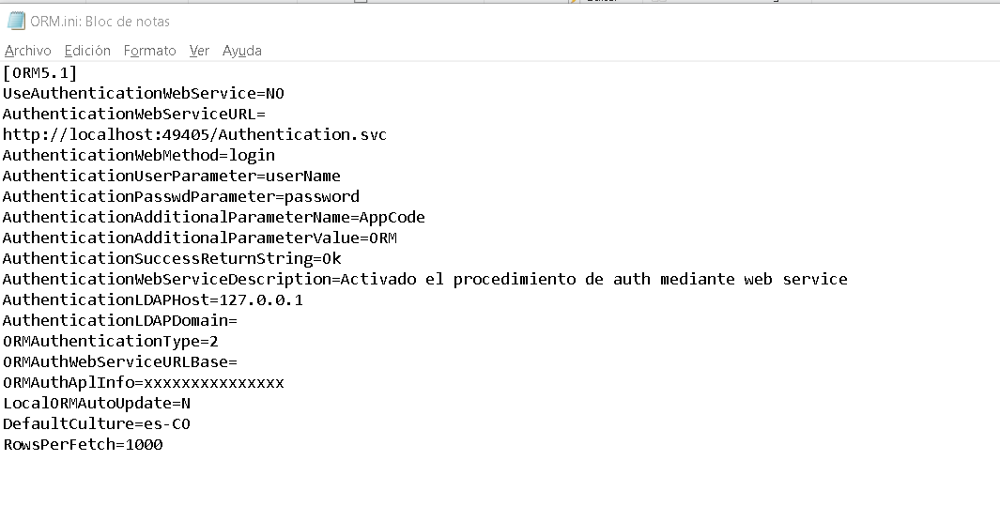
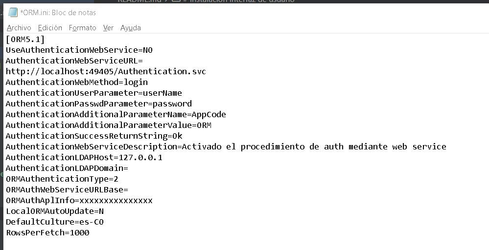

# Guía de Instalación ORM v5.1.0.8

## Introducción
Este repositorio contiene las instrucciones detalladas para llevar a cabo la instalación completa del ORM, tanto a nivel de la base de datos como en la capa del cliente.

## Instalación de Scripts en la Base de Datos para la creación del esquema ORM

**<u>Importante:</u>**
<u>Antes de comenzar con la instalación de los objetos en la base de datos, es fundamental realizar los ajustes pertinentes según sus necesidades. Esto incluye modificar nombres de usuarios, ubicaciones de datafiles, tablespaces, entre otros.</u>

## Implementación de Objetos
Para la instalación de los componentes sobre base de datos, siga el siguiente orden:

1. Ejecute los scripts del **00-02** utilizando el usuario **SYS**.
2. Ejecute los scripts del **03-07** utilizando el usuarios **ORM**.
3. Cada que ejecute un script debe validar su correcta aplicación.
4. Para finalizar puede validar que todos los objetos quedaron aplicados correctamente usando el script **08**, el cual contiene una consulta que muestra un listado detallado de cada item aplicado.
4. Ante cualquier error o novedad presentada por favor comunicarse con el área de soporte de Optima.

# Instalación interfaz de usuario 

1. Descargar archivo .zip llamado ORMv5.1.0.8 y pegarlo en una ruta segura como documentos o Carpeta en disco local
2. Una vez descomprimido debe dirigirse al archivo llamado ORM.ini el cual debe aparecer de la siguiente manera:

3. Se debe cambiar la opción de ```ORMAuthenticationType ``` y debe quedar en 1, es decir ```ORMAuthenticationType=1 ```

   *  Estado actual:

    

c

    * Debe quedar de la siguiente manera:

    

4. Configuramos el archivo ```ORMDatabases.txt``` en este archivo se debe ingresar la cadena de conexión correspondiente, por ejemplo;
    * ```MyLocalXE=localhost:1521/XE```
    En este caso para la prueba se utlizar una conexión dummie:
    


    


